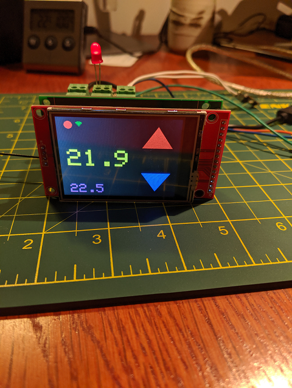
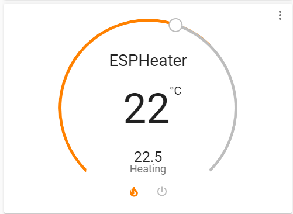
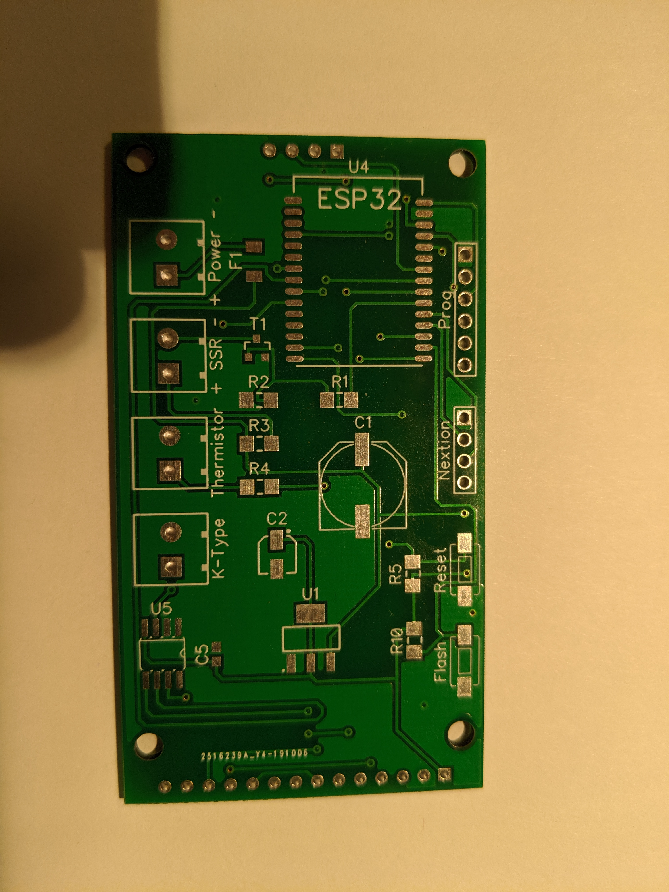
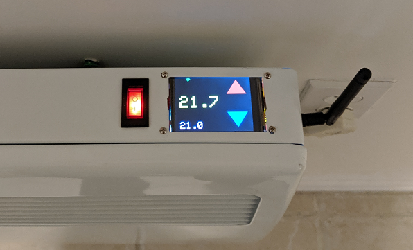
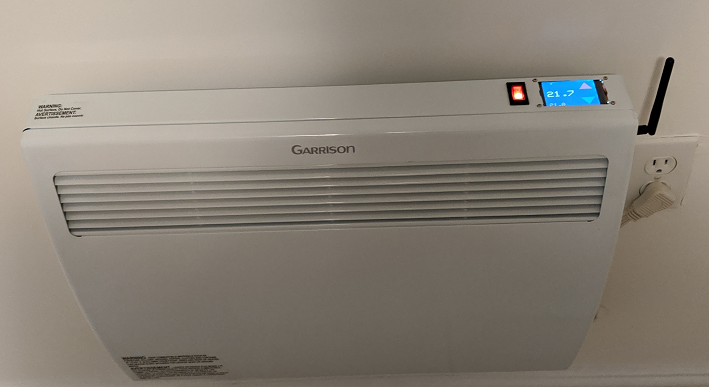

<h1>ESP32 thermostat</h1>

<p align="center">
  
</p>
<p>
The ESP Thermostat uses a ESP32-bit with an external antena, a 240 X 320 TFT touch display, and a 10K thermistor.
The element is controled by a Solid State Relay.

</p>
<p>
  
The thermostat includes support for MQTT. Please see wiki for details.

Home Assistant View
<p align="center">
  
</p>

<p>
Development environment used is Visual Studio CODE with the following extensions
<ul>
<li>PlatformIO IDE</li>
<li>C/C++</li>
<li>Arduino</li>
</ul>
</p>

<p align="center">
  
  
  
  
  
</p>

## License
```

 Copyright (c) 2019 - Graham Ross

  Licensed under the Apache License, Version 2.0 (the "License");
  you may not use this file except in compliance with the License.
  You may obtain a copy of the License at

       http://www.apache.org/licenses/LICENSE-2.0

  Unless required by applicable law or agreed to in writing, software
  distributed under the License is distributed on an "AS IS" BASIS,
  WITHOUT WARRANTIES OR CONDITIONS OF ANY KIND, either express or implied.
  See the License for the specific language governing permissions and
  limitations under the License.

```


Release notes:

-----------------

version 1.0.0

<ul>
<li>Initial commit</li>

</ul>

-----------------

